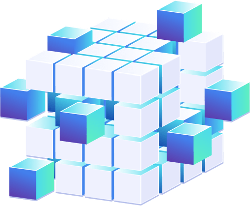

 
 

# ✔️ Descrição do Projeto:
***Programa:*** Devstar PayLivre!
 
Formação completa que visa transformar você em um desenvolvedor back-end PHP na Paylivre, uma fintech em pleno crescimento.

***Realização:*** be.academy

***Curso:*** PHP

***Aula:*** Introdução a Lógica de Programação - Exercícios

***Professor:*** Marcos Monteiro

 

# ✔️ Técnicas e tecnologias utilizadas
- ``VisualG``
 

# ✔️ Sobre
### Paylivre
>A Paylivre nasceu dos desafios singulares do mercado de pagamentos, da visão e da vontade de transpor barreiras de uma equipe diversa. 
Acreditamos que nossos diferentes backgrounds não apenas promovem inovação, como também enriquecem experiências.
Nós trabalhamos juntos para construir um futuro sem divisas, onde o tempo não é escasso e as distâncias são sinônimo de oportunidade.

### be.academy
>Muito prazer, somos uma EdTech. Uma startup de educação que acredita no poder da inovação e das conexões na cultura de negócios, na transformação, na tecnologia, na revolução e na liberdade de empreender. 
Nós somos feitos dos resultados e da prática de grandes players do mercado atual, que lideram empresas exponenciais que estão revolucionando o mundo e mudando a forma de empreender como Facebook, iFood, Paylivre, Loggi, LinkedIn, Amazon, Vtex, Inova 360, Hotmart, Fiesp e Endeavor.
 

# ✔️ Links dos Exercícios
[1 - IMC](https://github.com/Ton-devstart/beacademy-devstart-logicadeprogramacao/blob/main/Exerc%C3%ADcios/1%20-%20IMC.ALG)

[2 - MENOR, ADULTO OU IDOSO](https://github.com/Ton-devstart/beacademy-devstart-logicadeprogramacao/blob/main/Exerc%C3%ADcios/2%20-%20MENOR%2C%20ADULTO%20OU%20IDOSO.ALG)

[3 - NOME E IDADE](https://github.com/Ton-devstart/beacademy-devstart-logicadeprogramacao/blob/main/Exerc%C3%ADcios/3%20-%20NOME%20E%20IDADE.ALG)

[4 - SALDO](https://github.com/Ton-devstart/beacademy-devstart-logicadeprogramacao/blob/main/Exerc%C3%ADcios/4%20-%20SALDO.ALG)

[5 - CALCULADORA BáSICA](https://github.com/Ton-devstart/beacademy-devstart-logicadeprogramacao/blob/main/Exerc%C3%ADcios/5%20-%20CALCULADORA%20B%C3%A1SICA.ALG)

[6 - ÁREA E PERÍMETRO](https://github.com/Ton-devstart/beacademy-devstart-logicadeprogramacao/blob/main/Exerc%C3%ADcios/6%20-%20%C3%81REA%20E%20PER%C3%8DMETRO.ALG)

[7 - DEPÓSITO OU SAQUE](https://github.com/Ton-devstart/beacademy-devstart-logicadeprogramacao/blob/main/Exerc%C3%ADcios/7%20-%20DEP%C3%93SITO%20OU%20SAQUE.ALG)

[8 - TABUADA](https://github.com/Ton-devstart/beacademy-devstart-logicadeprogramacao/blob/main/Exerc%C3%ADcios/8%20-%20TABUADA.ALG)

[9 - MúLTIPLOS DE 2](https://github.com/Ton-devstart/beacademy-devstart-logicadeprogramacao/blob/main/Exerc%C3%ADcios/9%20-%20M%C3%BALTIPLOS%20DE%202.ALG)

[10 - MúLTIPLOS DE 3](https://github.com/Ton-devstart/beacademy-devstart-logicadeprogramacao/blob/main/Exerc%C3%ADcios/10%20-%20M%C3%BALTIPLOS%20DE%203.ALG)

[11 - TRANSFERêNCIA BANCáRIA COM REPETIÇÃO](https://github.com/Ton-devstart/beacademy-devstart-logicadeprogramacao/blob/main/Exerc%C3%ADcios/11%20-%20TRANSFER%C3%AANCIA%20BANC%C3%A1RIA%20COM%20REPETI%C3%87%C3%83O.ALG)

[12 - TABUADA COM ENQUANTO](https://github.com/Ton-devstart/beacademy-devstart-logicadeprogramacao/blob/main/Exerc%C3%ADcios/12%20-%20TABUADA%20COM%20ENQUANTO.ALG)

[13 - NOME E SENHA DO CARTÃO](https://github.com/Ton-devstart/beacademy-devstart-logicadeprogramacao/blob/main/Exerc%C3%ADcios/13%20-%20NOME%20E%20SENHA%20DO%20CART%C3%83O.ALG)

[14 - OPERACAO MATEMATICA ENQUANTO](https://github.com/Ton-devstart/beacademy-devstart-logicadeprogramacao/blob/main/Exerc%C3%ADcios/14%20-%20OPERACAO%20MATEMATICA%20ENQUANTO.ALG)

[15 - TRANSFERENCIA BANCARIA](https://github.com/Ton-devstart/beacademy-devstart-logicadeprogramacao/blob/main/Exerc%C3%ADcios/15%20-%20TRANSFERENCIA%20BANCARIA.ALG)

[16 - EMPRÉSTIMO](https://github.com/Ton-devstart/beacademy-devstart-logicadeprogramacao/blob/main/Exerc%C3%ADcios/16%20-%20EMPR%C3%89STIMO.ALG)

[17 - LOGIN](https://github.com/Ton-devstart/beacademy-devstart-logicadeprogramacao/blob/main/Exerc%C3%ADcios/17%20-%20LOGIN.ALG)

[18 - IDADE DE VARIAS PESSOAS](https://github.com/Ton-devstart/beacademy-devstart-logicadeprogramacao/blob/main/Exerc%C3%ADcios/18%20-%20IDADE%20DE%20VARIAS%20PESSOAS.ALG)

[19 - 100 PRIMEIROS N. INTEIROS](https://github.com/Ton-devstart/beacademy-devstart-logicadeprogramacao/blob/main/Exerc%C3%ADcios/19%20-%20100%20PRIMEIROS%20N.%20INTEIROS.ALG)

[20 - SAQUE DE 150](https://github.com/Ton-devstart/beacademy-devstart-logicadeprogramacao/blob/main/Exerc%C3%ADcios/20%20-%20SAQUE%20DE%20150.ALG)

[21 - NOME E PREÇO DE 10 PRODUTOS](https://github.com/Ton-devstart/beacademy-devstart-logicadeprogramacao/blob/main/Exerc%C3%ADcios/21%20-%20NOME%20E%20PRE%C3%87O%20DE%2010%20PRODUTOS.ALG)

[22 - MÉDIA DO ALUNO](https://github.com/Ton-devstart/beacademy-devstart-logicadeprogramacao/blob/main/Exerc%C3%ADcios/22%20-%20M%C3%89DIA%20DO%20ALUNO.ALG)

[23 - CLIENTES](https://github.com/Ton-devstart/beacademy-devstart-logicadeprogramacao/blob/main/Exerc%C3%ADcios/23%20-%20CLIENTES.ALG)

[24 - MATRIZ QUADRADA](https://github.com/Ton-devstart/beacademy-devstart-logicadeprogramacao/blob/main/Exerc%C3%ADcios/24%20-%20MATRIZ%20QUADRADA.ALG)

[25 - PLANILHA DE 5 LINHAS E 4 COLUNAS](https://github.com/Ton-devstart/beacademy-devstart-logicadeprogramacao/blob/main/Exerc%C3%ADcios/25%20-%20PLANILHA%20DE%205%20LINHAS%20E%204%20COLUNAS.ALG)

 
# ✔️ Autores
- Wellington Bertolassi
- [@Ton-devstart](https://github.com/Ton-devstart)😄
 

